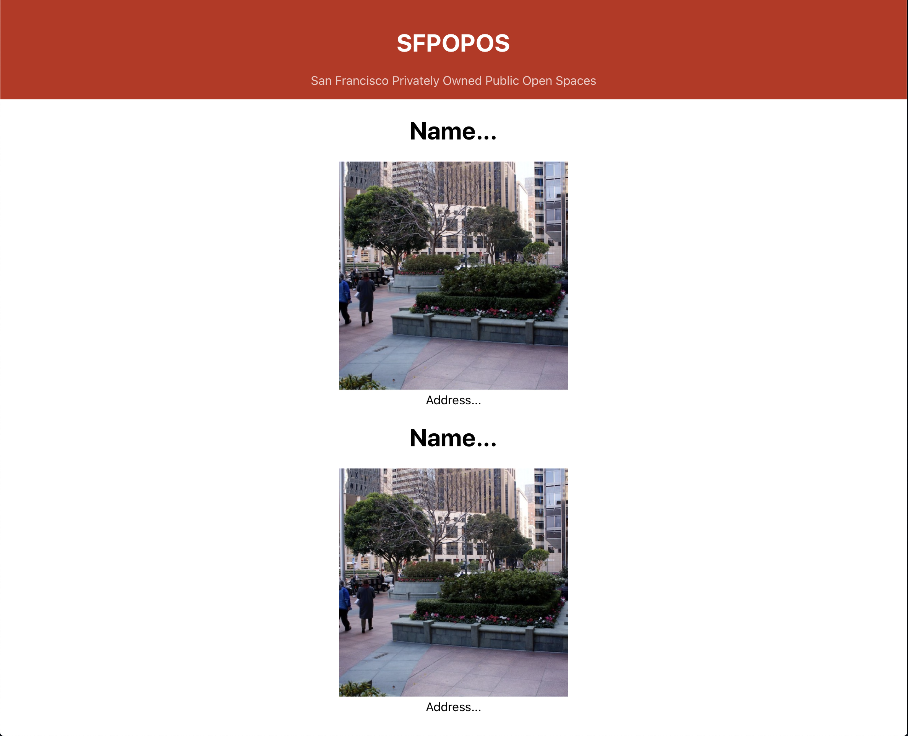

# Building Content

So far you have just been practicing with React to learn its work flow, structure, and syntax. Now you will use these ideas to put together a website.

Before making a site you should have an idea of what you are making. **The goal of this tutorial is to make a site for SFPOPOS (San Francisco Privately Owned Public Open Spaces).**

Here is what the city says:

POPOS are publicly accessible spaces in forms of plazas, terraces, atriums, small parks, and even snippets which are provided and maintained by private developers. In San Francisco, POPOS mostly appear in the Downtown office district area.

These public spaces are nice places to visit, eat your lunch, meet with friends, or do some work outside the office. The problem is many of these spaces are hard to find or people don't know they exist. This new site is going to solve this problem by showing an image of the space, the name and address of the space, and more information such as the hours the space is open, a description and facilities available these would be things like coffee, bathroom, art, indoors or outdoors etc.

People visiting this site could be almost anyone of almost any age. Recall the user stories you learned to write in SPD. Let's write some for possible users of our site:

- As a user I want to find all of the public open spaces in San Francisco
- As a user I want to find a public open space near me
- As a user I want to view details about pupblic open spaces I might want to visit.

With these user stories in mind we can start building the project.

For the first user story you can build a Component that displays all of the spaces. Imagine this as a grid with each cell or card in the grid displaying a single POPOS with it's picture and address.

To do this, you'll need to build a couple of components.

One Component will display a POPOS location with a picture, name, address, etc. Let's call this `POPOSSpace`. This component represents a single space at an address.

The other component will display a list of spaces. Let's call this: `POPOSList`. This component will display a list of spaces.

### Build the List

Make a new file: `src/POPOSList.js` and add the following code to it:

```js
// src/POPOSList.js

function POPOSList() {
  return (
    <div>
      <h1>Keep your eye on this space for future content...</h1>
    </div>
  )
}

export default POPOSList
```

Test out your list.

Import this file and use the new Component in `App.js`

Add the following to the top of `src/App.js`, then use the new Component:

```js
// src/App.js

import POPOSList from './POPOSList';

...

function App() {
  return (
    <div className="App">
      <Title />
      <POPOSList />
    </div>
  );
}
```

Testing your app at this point you'll see just the message: **"Keep your eye on this space..."**. This is just a place holder for the content you will add later.

React uses a Component Architecture. Notice how one component can contain another component and the App is built from many components each designed to display a single UI element.

# Creating the POPOSSpace Component

Currently the POPOSList doesn't display a list, but you'll be working on that! The goal is display a list of POPOSSpace components here, to do that you'll need to make a new Component.

For now, imagine each project has the following elements:

- Image
- Title
- Address

Let's make a component to show a project.

Make a new file: `src/POPOSSpace.js` and add the following code to it:

```js
// src/POPOSSpace.js

import logo from './logo.svg'

function POPOSSpace() {
  return (
    <div>
      
      <h1>Name...</h1>
      <div>Address...</div>
    </div>
  )
}

export default POPOSSpace
```

There are a few things missing here but you will revisit this shortly and pick up those details. You used the React Logo as a place holder for images that will come in the future.

For now import `POPOSSpace` into to your `POPOSList`.

In `src/POPOSList.js` add an import for `POPOSSpace.js`, then add a few Projects:

```js
// src/POPOSList.js

import POPOSSpace from './POPOSSpace';

...

function POPOSList() {
  return (
    <div>
      <POPOSSpace />
      <POPOSSpace />
      <POPOSSpace />
      <POPOSSpace />
    </div>
  )
}

...
```

Your project should now show a list of 6 POPOS Spaces.

What's important to understand here is that you can reuse a component as often as needed. In this case you're using `POPOSSpace` six times.

Also, notice how your project is structured.

- App
  - Title
  - POPOSList
    - POPOSSpace
    - POPOSSpace
    - POPOSSpace

If you imagine your project as tree structure you can see that you have components nested within components similar to the HTML DOM.

# Add some Local Image Files

This would look a lot better with some images.

Download the images here: [SFPOPOS-images](https://drive.google.com/file/d/1GUBZdIWndvcrwe_MHZLRU8hKDj2bQs0p/view?usp=sharing)

The code you write is not run directly. Instead the code you wrote is converted into vanilla JS and project is served from the public directory.

**Images and other static files that your project will use will often be referenced with the `public` directory as the root.**

Unzip the SFPOPOS-images.zip and move the images folder into the public directory of this project.

Now edit `POPOSSpace.js`.

```js
// src/POPOSSpace.js

...

function POPOSSpace() {
  return (
    <div>
      
      <h1>Name...</h1>
      <div>Address...</div>
    </div>
  )
}

...
```

Note! Here you set the path to an image by combing a variable and a string. This is a JavaScript expression and must be enclosed in `{...}`.

Your website should now look something similar to the following:



> **NOTE** - Static files must either be imported into a component or stored in the `public` folder. **The code you write in the `src` folder is not used directly.** It is processed and the resulting bundle is run from the `public` folder.

Take a close look at the `img` tag.

```html
...

...
```

You are putting a path together from two parts. Let's walk through how this line was derived.

When using an expression in JSX you must wrap it in `{}`.

``

We want to make a string that ends with 'images/50-california-st.jpg':

```html
``
```

The string needs to begin with the path to the public directory. React has an environment variable, `process.env.PUBLIC_URL`, that provides this. To use concatenate a variable with a string you'll use `${}` within the \``.

```html
``
```

Last, put the variable inside `${}`:

```js

```

# Making Dynamic Components with Props

Everything is working but it could still be better! All of the public spaces show the same name, address, and image. You want them all to be different, without having to make a new component for each.

Components take a parameter called: 'props'. Props is always an object. **Props allows you to configure components.** In this project you can use props to pass the name, address, and image into each instance of the POPOSSpace component which will allow each to display unique values.

In the case of the `POPOSSpace` Component there are three things that need to be dynamic:

- title
- image URL
- address


Start by defining `props`. Props is passed as a parameter to a component.

```js
// src/POPOSSpace.js

...

function POPOSSpace(props) { // Add props here!
  ...
}
```

Props is alway an object. Objects have properties you can access using the dot. For example:

- props.name
- props.image
- props.address

Add the following line to `function POPOSSpace(props)` in `src/POPOSSpace.js`:

```js
function POPOSSpace(props) {
  const { name, image, address } = props
  return (
    <div>
      
      <h1>{name}</h1>
      <div>{address}</div>
    </div>
  )
}
```

Testing at this point will not show anything since the values for: name, image, and address have not been defined yet. You'll define values for props where the component instance is created. This happens in `POPOSList.js`.

Edit your `POPOSList` function in `src/POPOSList.js` to the following:

```js
// src/POPOSList.js

...

function POPOSList() {
  return (
    <div className="POPOSList">
      <POPOSSpace
        name="50 California Street"
        address="50 California St."
        image="50-california-st.jpg"
      />
      <POPOSSpace />
      <POPOSSpace />
      <POPOSSpace />
      <POPOSSpace />
      <POPOSSpace />
    </div>
  )
}

...
```

The values for props are defined as attributes. The names here must match the names used within the component! Earlier you used: name, image, and address. These are the names that must be used here.

Compare the two components:

```js
// In POPOSList.js
<POPOSSpace
  name="50 California Street" // name
  address="50 California St." // address
  image="50-california-st.jpg"// image
/>
```

```js
// In POPOSSpace.js
function POPOSSpace(props) {
  // The attributes above set the values of these properties
  const { name, image, address } = props
  ...
}
```

## Props and Components

You now have a single Component which you can use as often as needed, and each instance of the component can display a different name, image, and address, _this is the power of props_. Props are used to configure your components.

You can assign props as key value pairs defined in JSX like attributes in HTML. Props can be any value strings, numbers, objects, arrays etc. For example:

```html
<MyComp message="Hello World" value={42} data={[1,2,3]} />
```

You can access props inside a component from the `props` object which is passed as a parameter, like so:

```js
function MyComp(props) {
  <div>
    <h1>{props.message}</h1> // Hello World
    <p>{props.value}</p> // 42
  </div>
}
```

JS expression inside JSX must be placed in the `{}`. For example: `<PI value={22/7} />`

Set the props: name, image, and address for the other components in `src/POPOSList.js`. The name, and address can be anything you like for now. For image, be sure to use the file name of one of the images in the images folder.

**Attempt the challenge before viewing the solution below!** You'll gain a lot more from typing the code yourself rather than just copy/pasting. Give it a try first!

<details>
<summary>View Solution</summary>
<br>

  When completed your component might look like this:

  ```js
  function POPOSList() {
    return (
      <div className="POPOSList">
        <POPOSSpace
          name="50 California Street"
          address="50 California St."
          image="50-california-st.jpg"
        />
        <POPOSSpace
          name="100 Pine Street"
          address="100 Pine St."
          image="100-pine.jpg"
        />
        <POPOSSpace
          name="101 California Street"
          address="101 California"
          image="101-california.jpg"
        />
        <POPOSSpace
          name="343 Sansome Roof Garden"
          address="343 Sansome St."
          image="343-sansome-roof-garden.jpg"
        />
        <POPOSSpace
          name="525 Market Street Plaza"
          address="525 Market St."
          image="525-market-street-plaza.jpg"
        />
        <POPOSSpace
          name="Citigroup Center"
          address="1 Sansome St."
          image="citigroup-center.jpg"
        />
      </div>
    )
  }
  ```

</details>

# Now Commit

```bash
$ git add .
$ git commit -m 'content component built'
$ git push
```

# Next

Click [here](../P03-Thinking-In-Components/) to move onto the next section about thinking in components.
